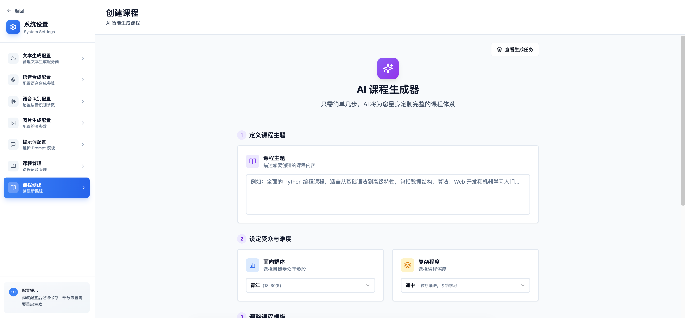
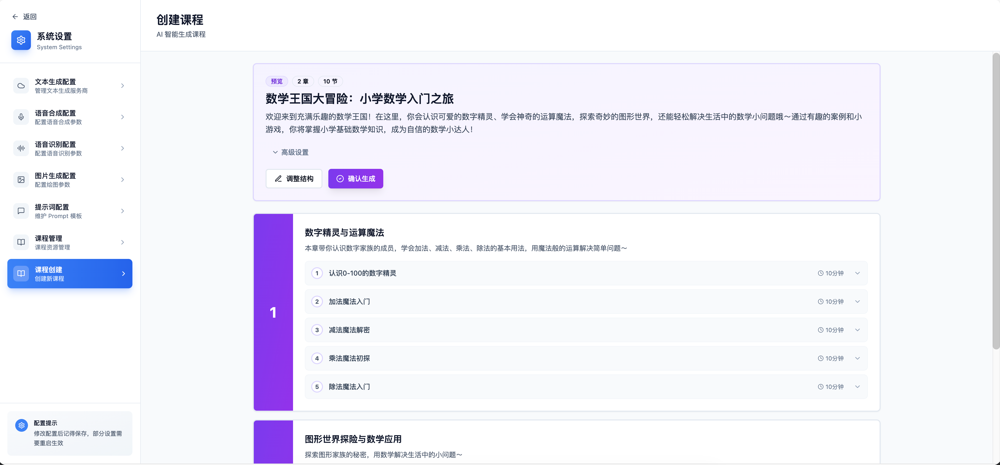
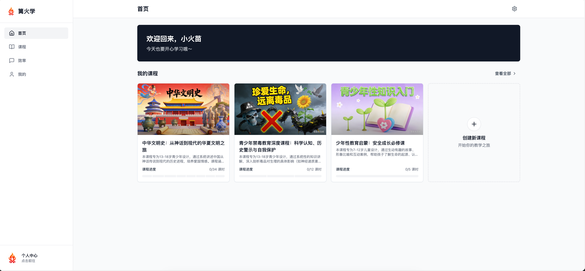
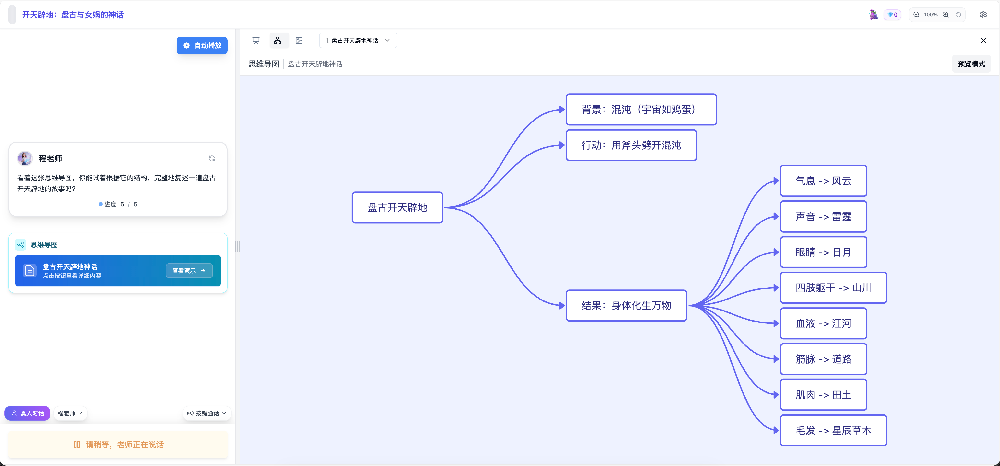
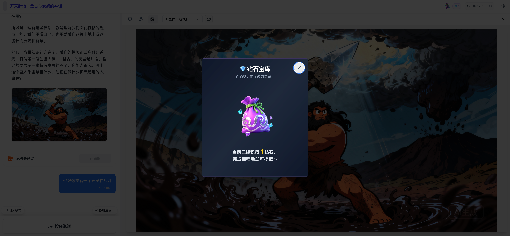
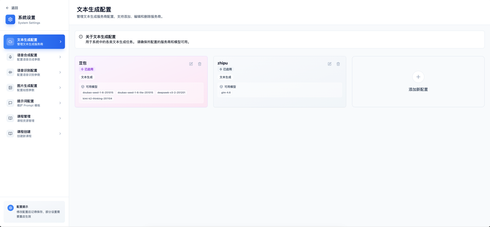

<br>
<br>
<br>
<div align="center">
  
  <h1>🔥 篝火学 (Flame Education)</h1>
  <p>
    <strong>点燃学习的火花，传承文明的薪火</strong>
  </p>
  <p>
      <a href="https://github.com/FlameEducation/FlameEducation">
        
      </a>
    <a href="LICENSE">
      
    </a>
    <a href="https://reactjs.org/">
      
    </a>
    <a href="https://www.typescriptlang.org/">
      
    </a>
    <a href="https://vitejs.dev/">
      
    </a>
    <a href="https://www.docker.com/">
      
    </a>
  </p>
</div>

---

## 📖 项目介绍

### 项目灵感

项目灵感来自于流量地球中的火种计划：人类文明面临灭绝的危机，由储备胚胎发育而成的新人类们需要在新的星球上重建家园。

偶然一次，我开始思考如果真的发生这种情况，谁来教他们识字、教他们数学、讲述人类的历史与文化呢？

本项目**篝火学 (Flame Education)** 正是基于这样的思考下诞生的。火焰代表着人的文明与知识的传承，也代表着在黑暗中指引方向的光明。

我希望利用现有的技术，能够实现将知识能够平等传授给每一个人的、有价值的教育工具。

无论是身处偏远地区的孩子，还是未来星际移民中的新人类，都能利用 AI 学习知识，激发人类智慧的火光。

---

## ✨ 核心特性

| 特性 | 描述 |
|------|------|
| 🤖 基于AI的全自动授课体系 | 融合大语言模型 (LLM)、语音识别 (ASR) 与语音合成 (TTS) 等前沿AI技术，实现课程生成、内容讲解至知识图谱构建的全流程自动化，让学习变得智能而高效。 |
| 📚 智能课程生成 | 内置强大课程生成引擎，只需输入任意主题（如"量子力学"、"罗马历史"），AI瞬间生成完整课程大纲与丰富内容，开启个性化学习之旅。 |
| 💬 实时语音交互 | 借助高精度语音识别与合成技术，支持打电话模式，让学习如同面对面对话般自然流畅，沉浸式体验AI教师的智慧指导。 |
| 🧠 智能思维导图 | 实时解析对话内容，动态生成可视化知识图谱，帮助学生直观构建知识网络，深化理解与记忆。 |
| 🎨 自由学习课 | 打破传统束缚，想学什么就生成什么课程，激发无限好奇心与探索欲，解锁个性化教育新维度。 |
| 📱 移动端友好 | 响应式设计完美适配手机与平板，随时随地开启学习模式，让优质教育触手可及。 |

---

## 📸 系统截图

<div style="display: flex; flex-wrap: wrap; justify-content: space-around;">
  <div style="text-align: center; margin: 10px; max-width: 45%;">
    
    <p><strong>课程创建</strong><br>只需要输入课程主题并选择难度，快速创建课程, 想学什么学什么</p>
  </div>
  <div style="text-align: center; margin: 10px; max-width: 45%;">
    
    <p><strong>调整课程</strong><br>调整课程目录、查看知识点等信息，灵活掌握课程方向</p>
  </div>
  <div style="text-align: center; margin: 10px; max-width: 45%;">
    
    <p><strong>系统首页</strong><br>展示课程列表和快速入口，用户可以轻松浏览和选择课程。</p>
  </div>
  <div style="text-align: center; margin: 10px; max-width: 45%;">
    
    <p><strong>设置页面</strong><br>按章、按节，结构化学习，模块化设计</p>
  </div>
  <div style="text-align: center; margin: 10px; max-width: 45%;">
    
    <p><strong>AI 教师界面</strong><br>与 AI 教师进行实时对话，享受个性化的教学体验。</p>
  </div>
  <div style="text-align: center; margin: 10px; max-width: 45%;">
    
    <p><strong>思维导图展示</strong><br>动态生成的知识图谱，帮助用户可视化学习进度。</p>
  </div>
  <div style="text-align: center; margin: 10px; max-width: 45%;">
    
    <p><strong>奖励机制</strong><br>通过智慧星系统对学生进行及时奖励。</p>
  </div>
  <div style="text-align: center; margin: 10px; max-width: 45%;">
    
    <p><strong>设置页面</strong><br>配置 AI 服务商和个性化选项，定制学习环境。</p>
  </div>

</div>

---

## 如何使用

简单3步即可开始你的 AI 学习之旅：

1.  **配置 LLM 服务商**: 在设置页面选择并配置你喜欢的大语言模型服务商（如字节跳动豆包、DeepSeek、Google Gemini 等）。
2.  **激活教师**: 在设置页面中选择并激活一个 AI 教师角色，并绑定到课程上。
3.  **开始上课**: 在课程页面选择或创建一个课程主题，AI 教师将自动生成课程内容并开始授课。你可以通过语音与教师互动，提出问题或请求进一步解释。
4.  **可选**: 配置语音识别、语音合成和图像生成服务商，提升学习体验。

---

## 🧩 支持的服务商（LLM、ASR、TTS、图片生成）

项目的运行离不开现有的各类服务支持。以下是目前已经支持及计划接入的各类服务商列表：

### 🧠 大语言模型

经过开发者测试，大模型存在对DEI、政治立场等场景的意识形态诱导问题。例如部分模型在生成少儿性教育科普课程时，会出现“尊重性别多元化”相关内容。

团队建议各位用户使用由中文境内公司推出的、收到政府监管的模型，确保幼儿在学习过程中不会受到错误意识形态的干扰。

| 服务商                    | 是否支持          |
|:-----------------------|:--------------|
| **字节跳动豆包（必须开启提示词缓存）**  | ✅             |
| **DeepSeek**           | ✅             |
| **智谱清言 GLM**           | ✅             |
| **Google Gemini**      | ✅             |
| **OpenAI (GPT)**       | ✅             |
| **OneApi (OpenAI 兼容)** | ✅             |
| **Ollama**             | ❌ (暂不支持，很快更新) |
| **百度文心一言**             | ❌ (暂不支持)      |
| **通义千问 Qwen**          | ❌ (暂不支持)      |
| **Anthropic (Claude)** | ❌ (无支持计划)     |

### 🗣️ 语音识别
| 服务商                     | 是否支持 |
|:------------------------| :--- |
| **字节跳动 火山引擎流式音频识别**     | ✅ |
| **Google Gemini 多模态识别** | ✅ |
| **阿里云流式音频识别**           | ❌ (暂不支持) |
| **百度云流式音频识别**           | ❌ (暂不支持) |
| **OpenAI Whisper**      | ❌ (无支持计划) |

### 🔊 语音合成
| 服务商                     | 是否支持 |
|:------------------------| :--- |
| **字节跳动豆包 TTS**          | ✅ |
| **Microsoft Azure TTS** | ✅ |

### 🎨 图像生成

| 服务商                      | 是否支持 |
|:-------------------------| :--- |
| **字节跳动豆包 Seedream 系列模型** | ✅ |
| **硅基流动 (FLUX)**          | ✅ |
| **Google Imagen**        | ✅ |
| **阿里Qwen 图像生成**          | ❌ (暂不支持) |
| **百度 文心一格**              | ❌ (暂不支持) |
| **Midjourney**           | ❌ (无支持计划) |
| **DALL-E 3**             | ❌ (无支持计划) |
---

## ⚖️ 许可协议

本项目（包括代码、文档及容器镜像）遵循以下使用协议：

*   ✅ **个人免费使用**: 您可以免费下载、安装、运行本项目用于个人学习、研究或非营利性用途。
*   🚫 **禁止商业用途**: 未经授权，严禁将本项目用于任何形式的商业盈利活动（包括但不限于售卖软件、提供付费服务、企业内部部署等）。

---


## 🚀 快速开始

### Docker 一键部署

```bash
# 拉取并运行完整镜像 (包含前端 + 后端)
docker run -d \
  --name flame-education \
  -p 8080:80 \
  -v /your/host/storage/path:/opt/storage \
  -e PG_DB=flame-education \
  -e PG_HOST=127.0.0.1 \
  -e PG_PASSWORD=passwd \
  -e PG_PORT=5432 \
  -e PG_USERNAME=flame-education \
  -e STORAGE_DIR=/opt/storage \
  flameeducation/flame-education:latest
```

### 环境变量说明

| 变量名 | 默认值 | 说明                    |
|:-----------------|:-----------------|:----------------------|
| `PG_DB` | `flame-education` | PostgreSQL 数据库名       |
| `PG_HOST` | `127.0.0.1` | PostgreSQL 服务器地址      |
| `PG_PASSWORD` | `passwd` | PostgreSQL 密码         |
| `PG_PORT` | `5432` | PostgreSQL 端口         |
| `PG_USERNAME` | `flame-education` | PostgreSQL 用户名        |
| `STORAGE_DIR` | `/opt/storage` | 指定容器内文件的存储目录路径，便于目录映射 |

**注意**: 请根据您的实际环境修改这些环境变量值。容器内部使用 `/opt/storage` 作为存储目录映射。

**存储目录绑定推荐**: 为防止因容器重建导致的数据丢失，强烈推荐将 `STORAGE_DIR` 对应的容器目录 `/opt/storage` 与宿主机目录进行绑定挂载。例如，使用 `-v /your/host/storage/path:/opt/storage` 参数。这样，即使容器被删除，数据仍保存在宿主机上。

启动后，访问 `http://localhost:${port}` 即可开始学习！

###  参与贡献

如果您想参与前端开发或自定义 UI，请按照以下步骤操作：

#### 1. 环境准备
*   Node.js (Recommended v18+)
*   npm or yarn

#### 2. 安装依赖

```bash
# 安装依赖
npm install
```

#### 3. 启动开发服务器

```bash
npm run dev
```

#### 4. 后端连接配置
默认情况下，开发服务器会代理 `/api` 请求到本地的 `http://127.0.0.1:8080`。
*   如果您已经在本地通过 Docker 运行了后端服务（如方式一）,只需要额外映射容器的 8080 端口即可。
*   如果后端服务运行在其他地址，请修改 `vite.config.ts` 中的 `server.proxy` 配置。

---

## 🤝 贡献指南

我们非常欢迎社区开发者参与到 **篝火学** 的前端建设中来！无论是修复 Bug、优化 UI 还是提交新功能，您的每一次提交都让这个项目变得更好。

1.  Fork 本仓库
2.  创建您的特性分支: `git checkout -b feature/AmazingFeature`
3.  提交您的修改: `git commit -m 'Add some AmazingFeature'`
4.  推送到分支: `git push origin feature/AmazingFeature`
5.  提交 Pull Request

---

<div align="center">
  <p>Made with ❤️ by Flame Education Team, Powered by human intelligence.</p>
</div>